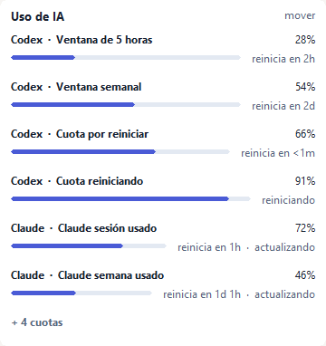
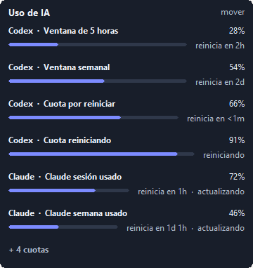
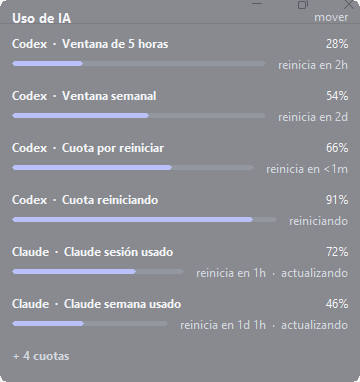
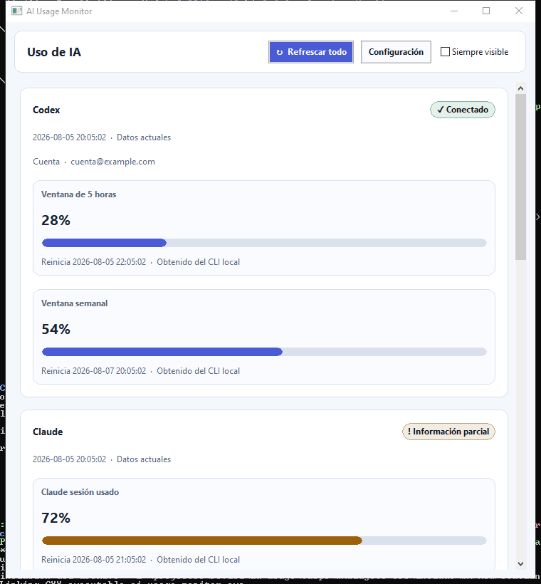
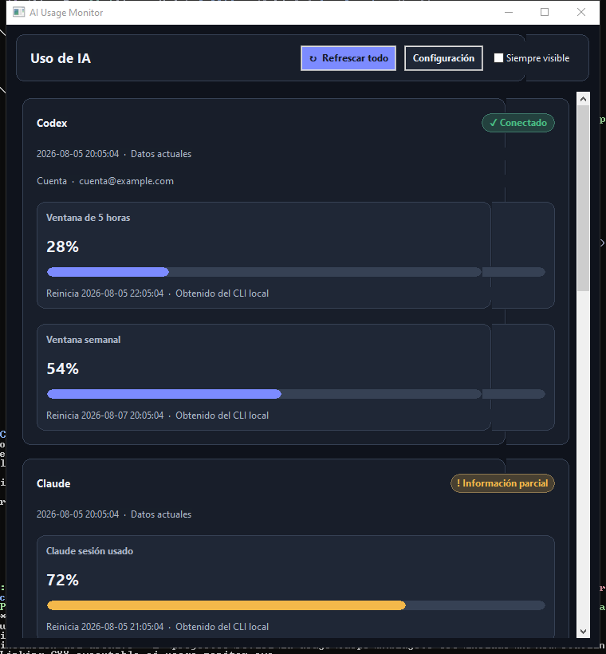
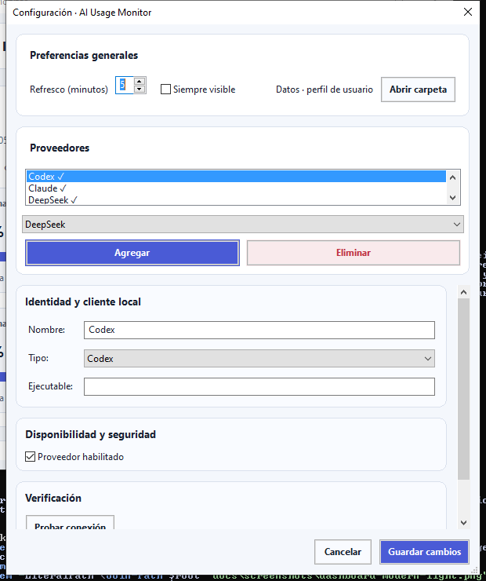

# AI Usage Monitor

Monitor visual, residente y portable para consultar el uso disponible de Codex,
Claude, Ollama y servicios OpenAI-compatible (incluido DeepSeek). Está escrito en C++20,
usa wxWidgets de forma estática y no necesita Python, JavaScript, Java ni el
VC++ Redistributable en el equipo donde se ejecuta.

## Estado de los proveedores

| Proveedor | Fuente | Datos mostrados |
| --- | --- | --- |
| Codex | `codex app-server` local | Cuenta, porcentaje usado por ventana, reinicio y tokens acumulados cuando el protocolo los publica |
| Claude suscripción | `claude /usage` local y no interactivo | Porcentaje usado y próximo reinicio de cada cuota que publique el cliente; no se configura API key ni se llama directamente a Anthropic |
| DeepSeek | `GET /user/balance` | Saldo por moneda y consumo derivado si se configura un presupuesto |
| OpenAI-compatible | `/models` y ruta configurable | Métricas definidas por JSON Pointer; nunca inventa una cuota que el endpoint no publique |
| Ollama | `GET /api/ps` y `POST /api/me` local o autoalojado | Disponibilidad del servidor, número de modelos cargados, memoria/VRAM por modelo, hora de descarga si la API la publica, y cuenta con su plan |
| Ollama Cloud | `GET ollama.com/api/usage` con API key propia | Porcentaje consumido y restante de la asignación mensual, y peticiones por modelo |

Las métricas indican su procedencia. “Derivado” significa, por ejemplo, `100 -
usado`; métricas de monedas o ventanas diferentes nunca se suman entre sí. En
Ollama, el estado local no requiere credencial alguna; los créditos mensuales
sólo aparecen si guarda una API key de ollama.com, porque ese dato vive
exclusivamente en la nube de Ollama. AI Usage Monitor no inventa tokens, cuotas,
costes ni históricos: el gasto y el saldo por cuenta no los publica ninguna API
de Ollama y se declaran como no soportados.

## Uso en Windows

Descargue o genere el ZIP, extráigalo en cualquier carpeta y ejecute
`ai-usage-monitor.exe`. La aplicación inicia oculta en la bandeja. Pase el
puntero sobre el icono para ver el resumen, haga clic para abrir el dashboard o
use el menú contextual para refrescar, configurar o salir.

La configuración permite un intervalo de 1 a 60 minutos (5 por defecto),
refresco manual, habilitar proveedores y mantener el dashboard “Siempre
visible”. En Windows también puede habilitar un overlay minimalista independiente:
muestra solamente el uso, una barra fina y el tiempo hasta cada reinicio. El menú
de bandeja permite mostrarlo, ocultarlo, bloquear los clics o recuperarlo; el atajo
global `Ctrl+Alt+U` alterna el bloqueo. Puede ajustar opacidad, esquina y ocultación
durante pantalla completa desde Configuración. Las claves se cifran para el usuario actual mediante DPAPI. Si la
carpeta del ejecutable es escribible se usa `data/` junto al EXE; si no, se usa
`%LOCALAPPDATA%\AIUsageMonitor`. Para desinstalar, salga desde la bandeja y
borre el ZIP extraído y, si existe, esa carpeta de perfil. No se crean servicios,
tareas programadas ni entradas de inicio automático.

## Interfaz

El dashboard usa tarjetas compactas, barras de progreso para cuotas
porcentuales y estados que siempre incluyen texto. Sigue el tema claro u oscuro
del sistema y reorganiza las acciones y Preferencias al reducir el ancho o
aumentar la escala de pantalla.

El overlay de Windows es una ventana pasiva, siempre encima y ausente de Alt+Tab.
Bloqueado deja pasar los clics a la aplicación inferior; desbloqueado se puede
arrastrar y encaja en la esquina más cercana. Conserva el monitor y la esquina,
limita su altura al 40 % del área de trabajo y resume el exceso como `+ N cuotas`.
No realiza refrescos propios: consume exactamente los mismos datos del dashboard.













Los controles nativos —barra de título, checkbox, campos y scrollbar— pueden
verse ligeramente distintos entre Windows, GNOME y KDE. Los colores semánticos,
la jerarquía, el contenido y el comportamiento compacto se mantienen.

HTTP se rechaza salvo para `localhost`, `127.0.0.1` o `::1` cuando se habilita
explícitamente. Las respuestas están limitadas a 1 MiB, los redirects están
deshabilitados y los procesos hijos tienen timeout y limpieza de árbol.

## Compilar en Windows

Requisitos verificados en este equipo: Visual Studio 2022 Community 17.14 con
MSVC 19.44, Windows SDK 10.0.26100, CMake 3.31 y Ninja. Desde PowerShell:

```powershell
cmd /d /c 'call "E:\Program Files\Microsoft Visual Studio\2022\Community\Common7\Tools\VsDevCmd.bat" -no_logo -arch=x64 && "E:\Program Files\Microsoft Visual Studio\2022\Community\Common7\IDE\CommonExtensions\Microsoft\CMake\CMake\bin\cmake.exe" --preset windows-release'
cmd /d /c 'call "E:\Program Files\Microsoft Visual Studio\2022\Community\Common7\Tools\VsDevCmd.bat" -no_logo -arch=x64 && "E:\Program Files\Microsoft Visual Studio\2022\Community\Common7\IDE\CommonExtensions\Microsoft\CMake\CMake\bin\cmake.exe" --build --preset windows-release'
& 'E:\Program Files\Microsoft Visual Studio\2022\Community\Common7\IDE\CommonExtensions\Microsoft\CMake\CMake\bin\ctest.exe' --preset windows-release
./scripts/test-ui-windows.ps1
```

Las versiones de wxWidgets y nlohmann/json están fijadas con SHA-256 en
`cmake/Dependencies.cmake`. Después de una primera descarga se puede configurar
sin red con `-DAI_USAGE_OFFLINE=ON`; la caché queda en `.deps`.

Para producir el ZIP portable:

```powershell
./scripts/package-windows.ps1
```

## Linux

El mismo código compila con wxGTK y libcurl. Secret Service (`secret-tool`) se
usa cuando está disponible; de lo contrario las claves sólo viven durante la
sesión y deben introducirse de nuevo. En escritorios sin host de bandeja, la
aplicación conserva el dashboard normal. Consulte `docs/linux.md` para compilar
y crear el AppImage. La matriz de CI valida Windows y Ubuntu; la disponibilidad
real del icono depende de GNOME/KDE y sus extensiones StatusNotifier.

## Privacidad y refresco

No se leen archivos privados de autenticación de los clientes. Codex usa su
app-server local y Claude ejecuta únicamente `claude /usage`, con salida
redirigida, sin stdin, sin pseudo-terminal y sin enviar un prompt al modelo. Un error conserva el último dato bueno como
obsoleto. El scheduler no sondea entre vencimientos, agrupa solicitudes repetidas
y aplica backoff acotado; “Refrescar” realiza un intento inmediato.

En Ollama, la URL por omisión es `http://localhost:11434` con HTTP de loopback
habilitado. Una instancia remota debe usar HTTPS. Si el servidor está protegido,
puede guardar una credencial Bearer en el almacenamiento seguro; si no la
introduce, la petición no incluye cabecera `Authorization`. La integración sólo
consulta `GET /api/ps` y `POST /api/me`, no llama a rutas de generación ni envía
prompts.

De `/api/me` se conserva únicamente el nombre de cuenta y el plan, que se
muestran como «Cuenta»; el correo y los identificadores que devuelve esa
respuesta se descartan y nunca llegan a la caché. Es una consulta complementaria:
si el servidor no tiene sesión iniciada, la observación de modelos cargados sigue
siendo válida y la tarjeta simplemente no muestra cuenta.

Para los créditos mensuales de Ollama Cloud, guarde una API key de
[ollama.com/settings/keys](https://ollama.com/settings/keys) en el campo «API key
ollama.com». Con ella la aplicación consulta `GET https://ollama.com/api/usage` y
muestra el porcentaje consumido de la asignación mensual y las peticiones por
modelo. Esa credencial es independiente de la del servidor configurado: viaja
sólo a ollama.com y nunca al `baseUrl`, y la del servidor local nunca viaja a
ollama.com. Sin API key no se contacta con ollama.com en absoluto.

Ese endpoint no está documentado (no figura en `llms.txt`, y `docs.ollama.com/api/usage`
describe otra cosa: métricas por petición) y devuelve el consumo como fracción
`0..1`, sin importe. Se muestra como porcentaje usado y restante, con la misma
barra que la cuota del resto de proveedores. La aplicación no deriva de ahí
ninguna cifra en dólares: haría falta una lista de precios que Ollama puede
cambiar sin avisar. Si la consulta falla, la tarjeta pasa a estado parcial,
conserva los modelos cargados y no inventa ninguna cifra.

El recuento de tokens, el gasto y el saldo por cuenta siguen sin estar
disponibles: ninguna API de Ollama los publica.
Las ubicaciones detectadas de los clientes estándar no se persisten: la configuración
guarda solamente `codex` o `claude` y resuelve su ruta mediante `PATH` al ejecutarlos.

## Licencia

MIT. Dependencias y avisos en `THIRD_PARTY_NOTICES.md`.
