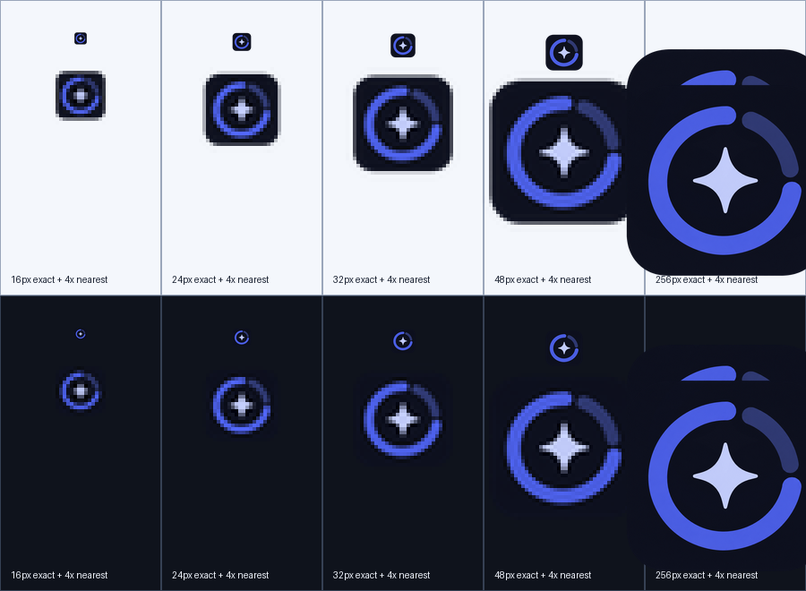

# Application icon

The AI Usage Monitor application icon combines an open quota ring with a central AI spark. The brand uses the interface indigo on a deep navy tile; green, amber and red remain reserved for live health states in the system tray.

## Asset family

- `assets/application-icon-1024.png` is the 1024×1024 RGBA master used for review and derivatives.
- `assets/application-icon.ico` is the Windows executable resource and contains 16, 24, 32, 48, 64, 128 and 256 px images.
- `packaging/linux/ai-usage-monitor.png` is the 512×512 RGBA desktop/AppImage asset.
- `docs/screenshots/application-icon-size-review.png` records exact-size and nearest-neighbor inspection on light and dark backgrounds.

Release builds consume these committed files directly. They do not call an image-generation service or require an image-processing dependency at runtime.

## Generation record

The master was created with the built-in image generation tool on 2026-08-13 using this final prompt:

> Use case: logo-brand. Asset type: production desktop application icon master for AI Usage Monitor. Create an original square app icon whose central symbol combines a bold open circular quota/usage meter with one simple four-point AI spark or node in the center. Use a centered rounded-square deep-navy tile, interface indigo for the quota ring and pale periwinkle for the spark. Keep a strong, symmetric silhouette designed to survive at 16 px. No text, letters, numbers, provider logos, trademarks, watermark, status colors, thin strokes, tiny ticks, extra symbols, decorative clutter, mockup or 3D treatment.

The generated RGBA source was normalized from 1254×1254 to the committed 1024×1024 master. Platform derivatives were produced locally from that master with high-quality downsampling and are committed so builds remain deterministic.

## Visual acceptance

Review completed on 2026-08-13 using the size sheet below.

| Size | Light background | Dark background | Result |
| --- | --- | --- | --- |
| 16 px | Tile, ring and center remain distinct | Ring and spark remain distinct | Accepted |
| 24 px | Open-ring gap is clear | Outer tile edge remains visible | Accepted |
| 32 px | Motifs are clean and balanced | Indigo contrast remains sufficient | Accepted |
| 48 px | Rounded silhouette and ring terminals are clear | No halo or clipped edge | Accepted |
| 256 px | Master composition remains consistent | Transparency and padding are clean | Accepted |

The review found no opaque corner artifacts, clipped edges, text-like detail or provider marks. Windows shell caches can retain earlier executable icons, so release smoke tests use a renamed executable in a clean directory.
